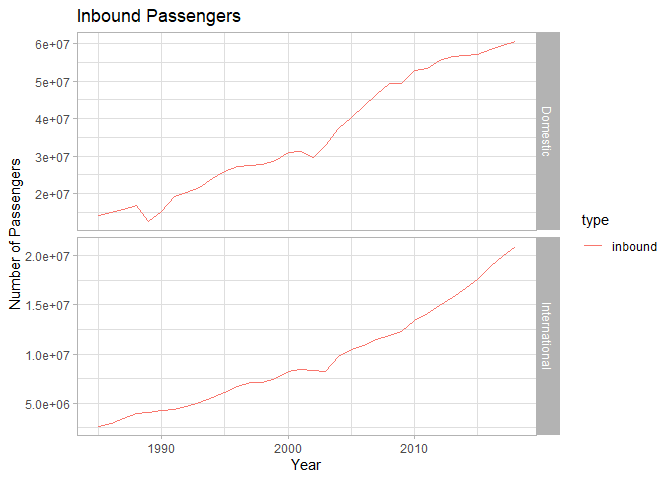

README
================
[](https://www.repostatus.org/#abandoned)

Mathew Ling, Steph de Silva, Maddie Davey, Nicholas Tierney, Adam Gruer
27/10/2017

## Ozflights

Welcome to Ozflights\! Get the data for passenger, aircraft and
international freight movements for both metropolitan and regional
airports in Australia. The dataset covers 1985-2016.

## Installation

You can install `ozflights` from github:

    #install.packages("devtools")
    devtools::install_github("ropenscilabs/ozflights")

## Package Author’s Notes

Data was available at URL as at 17/10/26. Data is imported into R and
cleaned by removing redundant headers and transforming into a tidy
format.

Airport ranking variable was removed: the interested party can
recalculate.

Uses the annual airport traffic data from the Australian Government
Department of Infrastructure and Regional Development located at:
<https://bitre.gov.au/publications/ongoing/airport_traffic_data.aspx>

Contact details for the data itself can be found in the original
spreadsheet, but please don’t contact the aviation stats team for
problems with the package\!

## Airline Passengers

To access the data on airport passengers, use the function
`airport_passengers()`.

``` r
passengers <- ozflights::airport_passengers()
```

    ## Warning in read_fun(path = enc2native(normalizePath(path)), sheet_i =
    ## sheet, : Expecting logical in N1025 / R1025C14: got 'Please refer to
    ## paragraph 7 of Explanatory Notes.'

    ## New names:
    ## * `` -> ...1
    ## * INBOUND -> INBOUND...5
    ## * OUTBOUND -> OUTBOUND...6
    ## * TOTAL -> TOTAL...7
    ## * INBOUND -> INBOUND...8
    ## * ... and 6 more problems

We’ll just look at the total for Australia.

``` r
library(ggplot2)
passengers_aus <- dplyr::filter(passengers, airport == "TOTAL AUSTRALIA")
passengers_aus$domest <- factor(passengers_aus$domest, levels = c(TRUE, FALSE), labels = c("Domestic", "International"))
passengers_aus_in <- dplyr::filter(passengers_aus, type == "inbound")
ggplot(passengers_aus_in)+
  labs(x="Year", y="Number of Passengers")+ 
  facet_grid(domest~., scale="free")+
  geom_line(aes(year, count, colour = type))+
  theme_light()+
  ggtitle("Inbound Passengers")
```

<!-- -->
